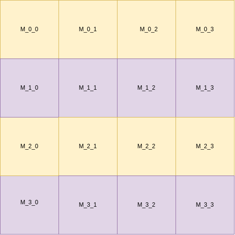

# Extending SimpleRA to Include Matrices

    We have implemented the following commands to extend the functionality SIMPLERA to Matrices
    - LOAD MATRIX <matrix_name>
    - PRINT MATRIX <matrix_name>
    - CROSS TRANSPOSE <matrix1_name> <matrix2_name>
    - EXPORT MATRIX <matrix_name>

    Since the size of a single row of matrix can be greater than the size of block, so the approach which was used to store the table need not be applicable for the matrix.
    So the approach which we used is to break the matrix into blocks so that we can apply the above mentioned operations in a easy and efficient manner.

**Page layout to store matrices**

    For storing the matrix into blocks, suppose we have a N*N matrix which is greater than the size of the block. We divide the matrix into M*M blocks so that we can store the M*M matrix into a single block. We also apply the padding if the M*M block have some empty spaces.
    The maximum block size which we used is 8KB and we can store 44*44 integers into a single block.
    These Blocks are stored into temp folders and the naming convetion for them are <matrixname>_<row_number>_<column_number>.

 

 
 

**Implementation of InPlace CROSS TRANSPOSE operation**

    For transposing the two matrices, the matrices first needs to be loaded. for transposing the matrices in-place we tranpose the two diagonally opposite blocks of two matrices at a time(m1_0_1 block of first matrix will transpose with m2_1_0 block of second matrix).
    This approach doesn't require much space as at a time we are only loading two blocks at a time in the main memory and once the two blocks get transposed then they are removed from main memory.

 

# Extending Part 2 to Sparse Matrices

    For storing the sparse Matrix we can store them like normal matrices but as in case of sparse matrices mosyt of the elements are zero so it will be a wastage of space, instead we can represent the sparse matrix in some tuple format where each tuple is (row_number,col_number_data). In this representation we only store the non-zero values in the tuple format and the zero values are ignored. This representation of sparse matrix is very efficient in terms of storage. 

    One more advantage of using tuple representation for storing sparse matrices is that it is very easy to do transpose operation as we only need to exchange the row and column value in the tuple representation. 
    So, using the tuple representation we can easily extend our SIMPLERA for sparse matrices in storage efficient manner.
